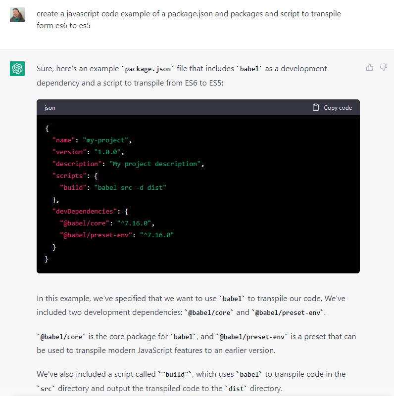
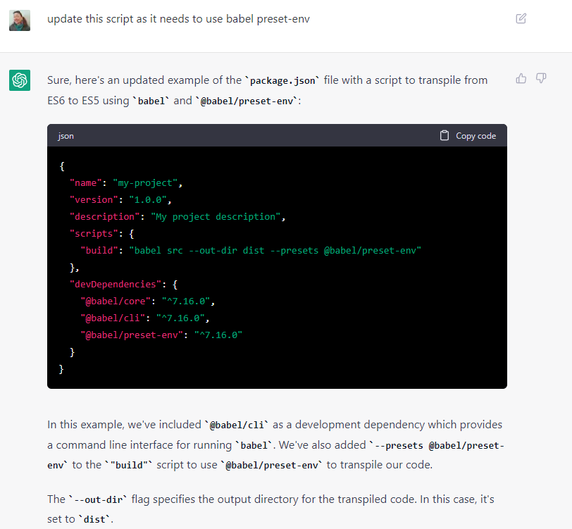
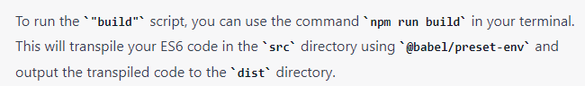
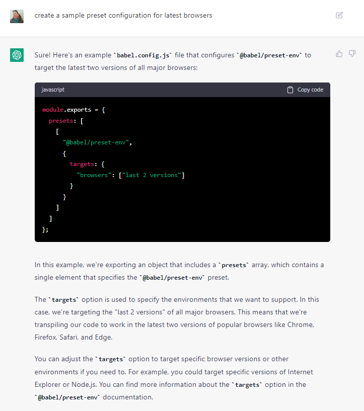
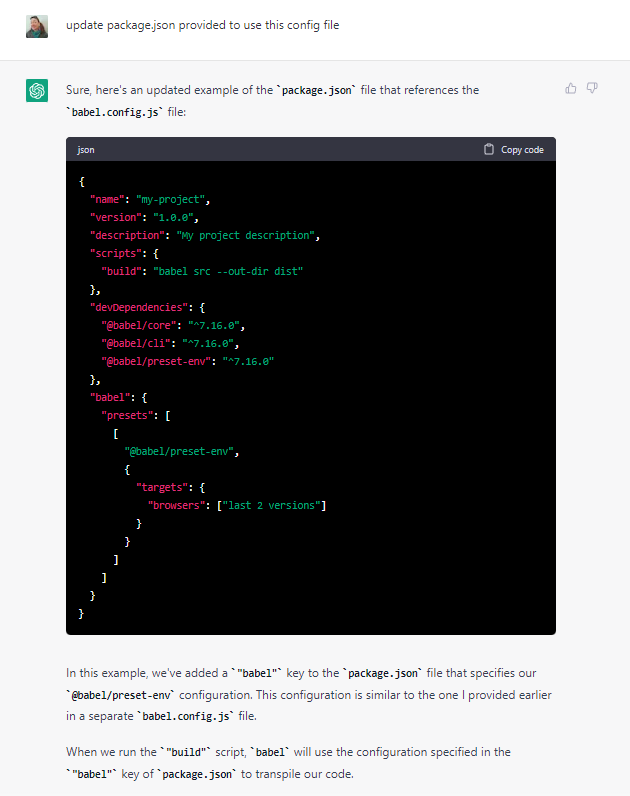
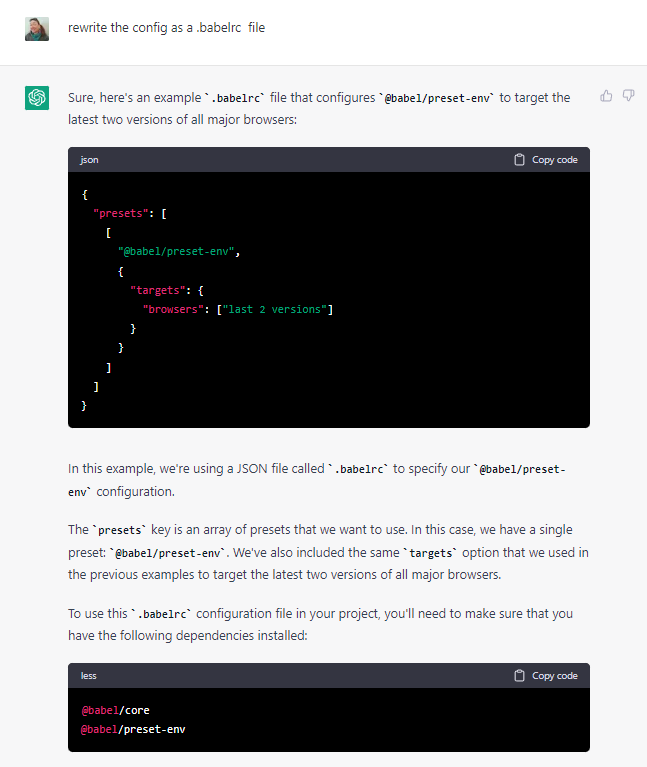
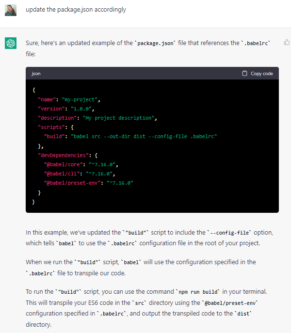

# Using ChatGPT I was able to quickly sort out the changes with versions of Babel.

## It didn't use the preset, though saved me typing

## Close, yet it didn't create a sample preset file

## And then I told it to update package.json to use the preset

## Ah, id rather have the config as .babelrc

## And needed that package.json updated again

## All in all, saved me time for sure. Not convinced yet we need to worry about our  dev jobs. Not yet.