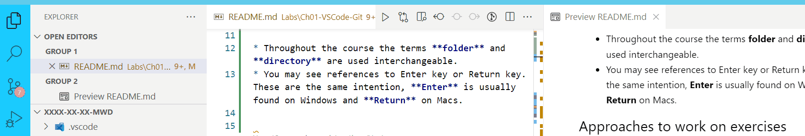
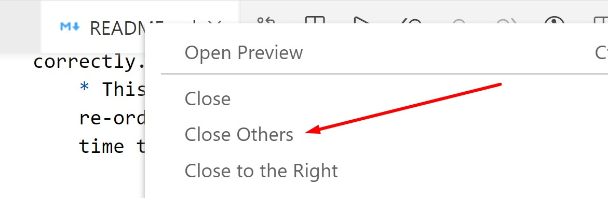

# Chapter 2: Lab 1 - VS Code & Markdown

## Objectives

* Practice with VS Code & extensions
* Practice with markdown files
* Create WIP directory used during class
* Practice committing in your own branch

## Terms

* Throughout the course the terms **folder** and **directory** are used interchangeable.
* You may see references to Enter key or Return key. These are the same intention, **Enter** is usually found on Windows and **Return** on Macs.

## Part 1 Observe VS Code Organization

It is quite common to need multiple windows and panes open at one time in VS Code, in order to compare files, read instructions, compare commit histories, read helpful instructions for projects and more.
 
Whether you primarily end up working on a small laptop screen or large 4k monitor, you want to be able to comfortably use VS Code and multiple file tabs - watch each of these animations, and revisit this section if you ever need help.

* Preview mode for readme.md markdown files is required to see the images and animations. If you want to increase an image size, you can drag the vertical separator, as shown in the following animation.

    

* The Sidebar Panes are toggles. Click to hide the active panel, or click and drag the vertical bar all the way left, when you want to have more space.

    

* Our markdown files are set to use split screen automatically because of the extension Auto Open. If the extension ever isn't working, or you have closed Preview Mode, you can use a method discussed in the lecture/on slides. Here is an example of using the Open Preview icon...

    

* Make sure you are in split screen mode viewing this document in both edit mode and preview mode.  With a markdown file open in both Edit mode and Preview mode, notice that if you scroll in one, the other scrolls as well. It does not always match up well when images are used.

* In VS Code, while viewing in Preview mode, if you double-click an area of the file, you will be taken to the line to edit what you see in the EDIT VIEW or "source" markdown file for editing.
  

* When you have split screen activated, the **Open Editors** area in the Explorer Pane will show **groups**. You should see this now while reading this readme.md file in VS Code.
  
    

* You can drag files between groups to separate them. Either in Editor area, as shown, or under Open Editors as well.

    

* When you click a file, it makes it the **active** file. Notice in the animation below, how clicking a file changes the highlight under **Open Editors** to show it is the active file.
  
    

* When you click in Explorer to open a new file, it opens in whichever Group is active. So, when reading the lab directions in Preview mode (with images), activate the other group, before opening, as shown here. That way you can keep reading the directions.

    

  
* If you have two screens, even another device like a tablet, you could use GitHub on the other screen to view the README in Preview Mode.

  Make sure you have provided a GitHub username to the instructor, so that you can be added to this course repository - and have access to your work even after class.

  On GitHub you can also hide the sidebar as shown.

    

* If you do use GitHub on another device, you cannot copy and paste files. You could use GitHub to view, and then copy paste files from repo in VS Code when directed to. 

  If using a VPN to connect to the Lab Machine - and you want to copy/paste between host and Lab machine,  get familiar with how Guacamole allows for this using Control-Alt-Shift.

    

## Closing Tabs / Files

* You can close tabs by either right clicking a tab in the edit pane and getting this menu...

    
   
* Or by using the Explorer pane to right click or close entire group.
    

