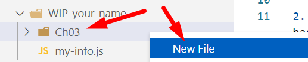
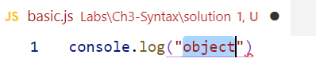
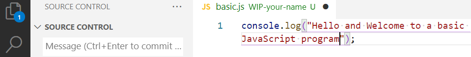
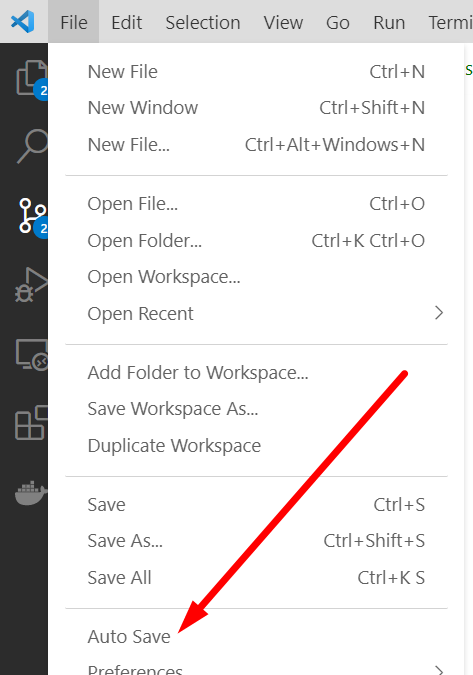
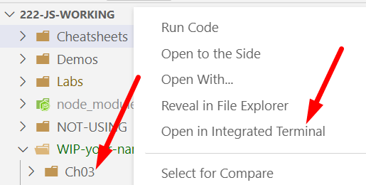
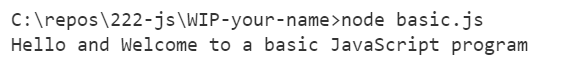

# Chapter 3: Lab 1 Create a basic program

## Objectives

* Practice with syntax
* Create and run new Javascript file

## Part 1 Practice with concepts

1. Complete these 5 exercises on variables: <https://www.w3schools.com/js/exercise_js.asp?filename=exercise_js_variables1>

1. Complete these exercises on operators: <https://www.w3schools.com/js/exercise_js.asp?filename=exercise_js_operators1>

1. Complete this exercise on data types.
<https://www.w3schools.com/js/exercise_js.asp?filename=exercise_js_datatypes1>

1. Create functions in these 4 exercises. <https://www.w3schools.com/js/exercise_js.asp?filename=exercise_js_functions1>

1. Practice with objects in these 3 exercises. <https://www.w3schools.com/js/exercise_js.asp?filename=exercise_js_objects1>

## Part 2 Create and run files

1. Create a new folder in your WIP folder called Ch03. You can do this by right-clicking on the WIP folder and choosing new folder.

2. Create a new file in this folder called basic.js by right-clicking on the folder and choosing new file.

    

3. In the file, add a console.log() statement by expanding the shortcut `clg`, then add double quotes which will surround the word object in quotes:

    

1. Now type the message `Hello and Welcome to a basic JavaScript program` which replaces the word `object`.

   

1. Your code will now have changes and will not be saved. This is indicated by both the vertical menu and the tab at the top of the editor. Always save your changes! If you ever get rid of code you need etc, you can use GIT to recover it. Oftentimes if your code is not doing what you expect, it is due to an unsaved file.

1. The fastest way to manually save your file is by using `Control + S`. Save your file now. Going forward there will no longer be directions on how to save files. Be sure to do this as you make changes.

    An alternative to control+s is to choose to automatically save your files in VS Code.

    

1. Run your `basic.js` program using Node from the terminal. We must run from the terminal in the correct location. Use the Explorer pane of VS Code. Right click on the file and choose Open in Terminal.

    

1. Run the code using the node command and name of the file. You should see the output.

    

1. Mark your work as complete (online spreadsheet or in-class name tent card) then go on to the bonus for Chapter 3.