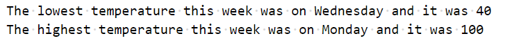

# Chapter 4: Lab 1 Code Blocks practice

## Objectives

* Practice with syntax
* Create and run new Javascript file

## Part 1 Practice with concepts

1. Complete these exercises on comparisons: <https://www.w3schools.com/js/exercise_js.asp?filename=exercise_js_comparisons1>

1. Complete these 2 exercises on conditions: <https://www.w3schools.com/js/exercise_js.asp?filename=exercise_js_conditions1>

1. Complete these exercises on switch: <https://www.w3schools.com/js/exercise_js.asp?filename=exercise_js_switch1>

1. Complete these exercises on for loops:
<https://www.w3schools.com/js/exercise_js.asp?filename=exercise_js_loops1>

1. Complete these exercises on while loops:
<https://www.w3schools.com/js/exercise_js.asp?filename=exercise_js_loop_while1>

1. Complete these exercises using break:
<https://www.w3schools.com/js/exercise_js.asp?filename=exercise_js_break1>


## Part 2 Create a best match algorithm

1. Create a new folder in your WIP folder called Ch04. You can do this by right-clicking on the WIP folder and choosing new folder.

2. Create a new file in this folder called **weatherweek.js** by right-clicking on the folder and choosing new file.

3. In the new file, define an array of objects that contain the temperatures for a week. Once you create one object - you could copy and paste to create the format of the rest.

    

1. Now write code that loops through the array tracking the highest high and the lowest low. In the end output the result in this type of format:

    

    You can scroll down past the rectangle below for additional help or to compare your approach once you have your code working.

    ```javascript

    //scroll down for hints or to compare your approach


    //keep scrolling down for hints or to compare your approach


    ```


1. Before you loop over the array - you can create two variables to hold the best low and and the best high. Assume the first item in the array is the best. Then as you loop you can update the variables. 

    Create two variables - one called lowestDay and one called highestDay.  

   

1. You can use VS Code to create the structure of your for loop. Begin typing for and choose the option with the dots underneath. 

   

1. With the structure in place you can hit tab to accept index as the name of the variable that tracks the index, and then change the array to the name of your weather week array. Hit tab again to change `element` to `day`.

   

1. Add the conditional logic to look at the current day element in the loop and replace the best match if necessary. 

   

1. Use a console.log statement with backticks to show the results. Not the line numbers in this example, do not introduce line breaks when using backticks.

   


1. Mark your work as complete (online spreadsheet or in-class name tent card) then go on to the bonus for Chapter 4.