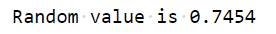
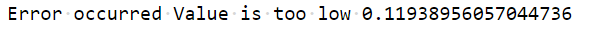
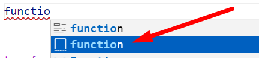
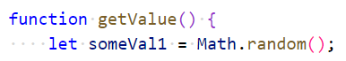
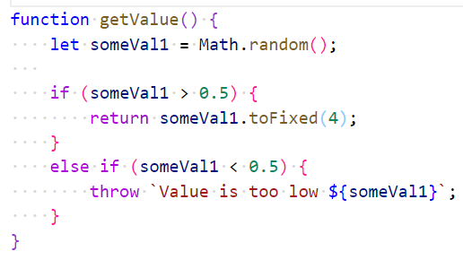
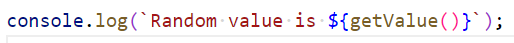
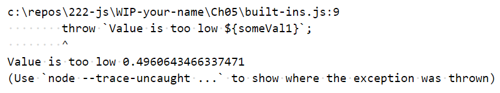
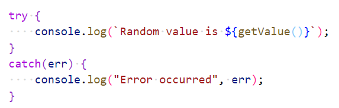

# Chapter 5: Lab 1 Practice with built-in objects

## Objectives

* Practice with syntax
* Create and run new Javascript file

## Part 1 Practice with concepts

1. Complete these exercises on string methods: <https://www.w3schools.com/js/exercise_js.asp?filename=exercise_js_string_methods1>

1. Complete these exercises on dates: <https://www.w3schools.com/js/exercise_js.asp?filename=exercise_js_dates1>

1. Complete these exercises using Math.
<https://www.w3schools.com/js/exercise_js.asp?filename=exercise_js_math1>

## Part 2 Create and run files

1. Create a new folder in your WIP folder called Ch05. 

2. Create a new file in this folder called built-ins.js

## Overview

3. In this new file, create a function called getValue() that generates a random value. If the value is greater than 0.5 return it with 4 decimal places. Otherwise throw an exception message that the value is too low. Call the function from inside a try block and if an exception is caught display it. Use template expressions to format data similar to this:

    * when data is returned:
    

    * when an exception occurs:
    

    You can scroll down past the rectangle below for additional help or to compare your approach once you have your code working.

    ```javascript

    //scroll down for hints or to compare your approach


    //keep scrolling down for hints or to compare your approach


    ```

1. To create function you can start typing function and choose the template. You can then hit tab to name the function getValue, hit tab then delete to remove params, then hit tab again to be in the body of the function.

    


1. Add a statement to assign a random number to a variable.

    

1. Add conditional logic to see if the number is > 0.5 - if it is return the value. If it is not, throw and error with a message that contains the value.

    

1. Call the function from within a console.log statement. 

    


1. Run your code a few times. When the exception is thrown it is not pretty.

    

1. Wrap the call to the function in a try / catch block to format for the exception condition.

    

1. Run your code a few times to see that both normal and exception output is formatted okay. 

1. Mark your work as complete (online spreadsheet or in-class name tent card) then go on to the bonus for this chapter.