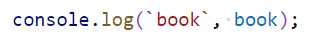
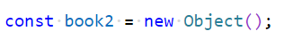

# Chapter 6: Lab 1 Create objects

## Objectives

* Practice with syntax
* Create and run new Javascript file

## Part 1 Create and run files

1. Create a new folder in your WIP folder called Ch06.

2. Create a new file in this folder called 1-create.js

## Overview

In your new file create two book objects with the properties of author, title, price and pages. You can use your own values, or the data in the steps below.  First using an object literal notation, then using new Object(). Print both objects using console.log.

## Steps

1. In your new file, create an object called book. Use const since you will not reassign this variable.

    

1. Use clo shortcut to print this object.
    

1. Run code to see output using Code Runner.
    

1. Create another book using new Object() syntax.

    

1. Type book2 then the dot notation to begin adding properties. Notice the pop-up from VS Code is trying to be helpful suggesting properties in the other book object. 

    

1. Add the same properties using the dot notation. As you type notice how VSCode will autocomplete for you. When typing strings you can jump to the end of the line using the END key to place the semicolon.

    

1. Use clo shortcut to print this book.

    

1. Mark your work as complete (online spreadsheet or in-class name tent card) then go on to the bonus.

## Bonus

1. Create an array for both books and loop through printing this message:

    
