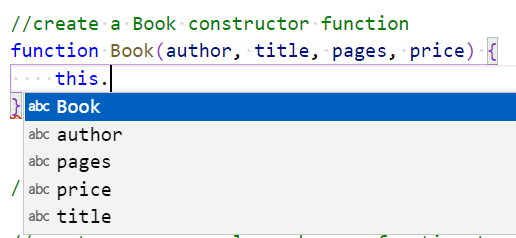
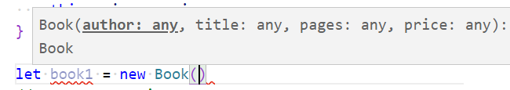
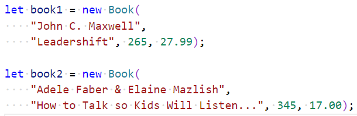
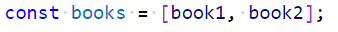
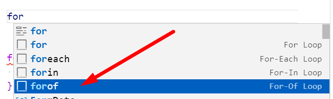
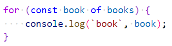
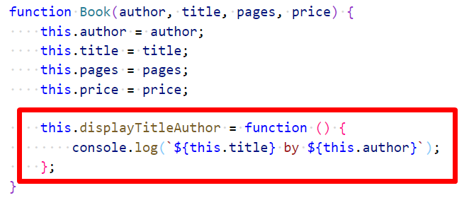

# Chapter 6: Lab 2 Constructor functions

## Objectives

* Practice with syntax
* Create and run new Javascript file

## Overview

Create a constructor function for Book with properties author, title, pages, price. Create a printDetails function to print the information.

## Steps

1. In your WIP/Ch06 folder, create a new file called 2-constructor.js

    

1. Start to create a new Book object and notice the popup.

    

1. Create two books using a call to the constructor with the keyword new. The newlines are not necessary though help with readability.

    

1. Create an array with the two books.

    

1. Create a for loop for the books. Use the shortcut for the for..of loop.

    

1. Update the for loop to use `book of books` and print the books using clo shortcut using the book variable that represents the book for each iteration in the loop.

    

1. Improve the formatting by updating the constructor function to include a new function called **displayTitleAuthor**. Notice in the red box below the content of the function and where to put it. Pay special attention to the syntax.

    

1. Create another for loop and use the new function.
    

1. Run your code and check that it works as expected.
1. Create another forloop and use the new function.
    

1. Mark your work as complete (online spreadsheet or in-class name tent card) then work on bonuses.

## Bonus

1. Call constructor function without calling new. What happens? Refer to slides and prevent from calling constructor function without new.