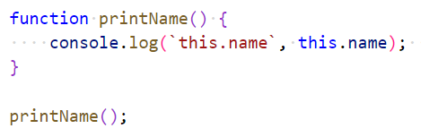
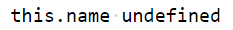
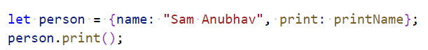
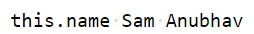
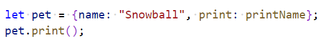

# Chapter 6: Lab 3 The keyword this 

## Objectives

* Practice with syntax
* Create and run new Javascript file

1. In your WIP/Ch06 folder, create a new file called 3-this.js. 

1. Define a function printName that uses the keyword this and then call the function.

    

1. Run your code an examine the output. You should see undefined.

    

1. Create an object literal that assigns this function to a property then call it.

    

1. Run and examine output. 

    

1. You can create another object which uses this function again, and call it on this new object.

    

1. Run and examine output. It should work for this new object as well.
 
1. Mark your work as complete (online spreadsheet or in-class name tent card) then work on bonuses.

## Bonus

Create another function called printNameBackwards. Write the logic to reverse name. Use MDN docs on String functions. Recall String is an array of characters.