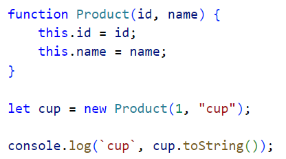
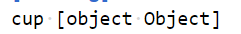
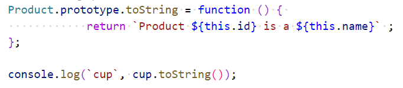
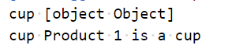

# Chapter 6: Lab 4 Prototypes

## Objectives

* Practice with syntax
* Create and run new Javascript file

1. In your WIP/Ch06 folder, create a new file called 4-prototype.js

1. Define a constructor function called Product. Create an instance and use clo shortcut to print it.

    

1. Notice this is the default print format for objects to show it is an object.

    

1. Override the toString function using the prototype syntax and print again.

    

1. Rerun your code - you should now see the new output.

    

1. Mark your work as complete (online spreadsheet or in-class name tent card) then work on bonuses.

## Bonus

1. Define a constructor function called Customer that takes in name and email. Create a toString function that prints the data in a nicely formatted way. 