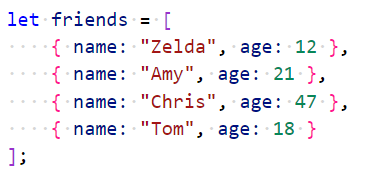
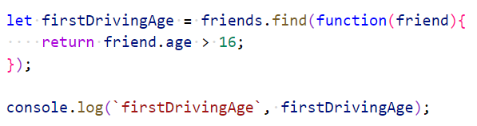
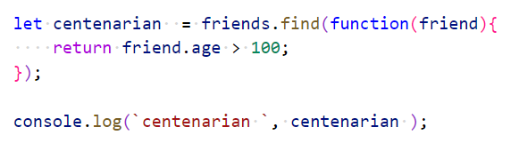
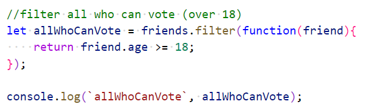

# Chapter 6: Lab 5 Array.Prototype
## Objectives

* Practice with syntax
* Create and run new Javascript file

1. In your WIP/Ch06 folder, create a new file called 5-array-prototype.js

1. Define an array of friends with some ages under 16 some over 21. Recall once you have one object literal you can copy and paste it to quickly have the correct structure.

    

1. Find the first friend who is of legal driving age. Print out the result.

    

1. Create another find function looking for someone over the highest age you specified. Print. Run your code. What is the returned data type?
    

1. Create a filter function for everyone who can vote. Print the results. What is the data type? Did you get the results you expected?

    

1. Mark your work as complete (online spreadsheet or in-class name tent card) then work on bonuses.

## Bonus

1. Create a sort function to sort friends by name. Test your code.

1. Create a sort function to sort friends by age. Test your code.

1. Create a new function that receives as input an array, and a string that represents a passed in attribute. Use this to sort the passed in array by that attribute.
