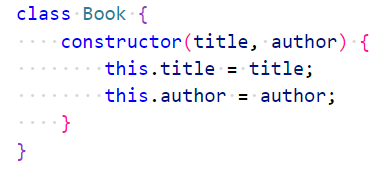
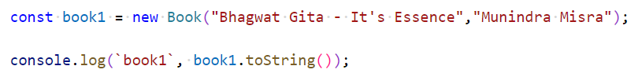
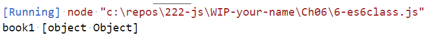
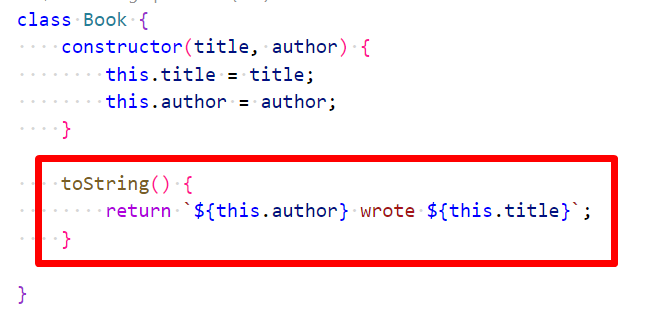
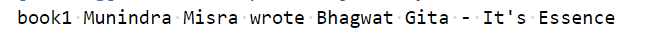

# Chapter 6: Lab 6 ES6 Class

## Objectives

* Practice with syntax
* Create and run new Javascript file

## Overview
Create a class to represent book with constructor for title and author. Create instances and print info.

1. In your WIP/Ch06 folder, create a new file called 6-es6class.js

1. Create the structure for the class doing initialization in the constructor. 

    

1. Create an instance and print the object using toString()

    

1. Run the code and note the default printed output.

    

1. Add a toString in the class to override this default behavior.

    

1. Rerun your code to see the expected output.

    

1. Mark your work as complete (online spreadsheet or in-class name tent card) then work on bonus.

## Bonus

1. Create a new class called Flight - that takes in originationCity, destinationCity and flight number.

2. Create a toString that prints nicely. 

3. Create an array of 3 flights.

4. Print. Sort by city. Print again.

