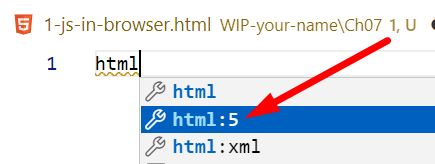
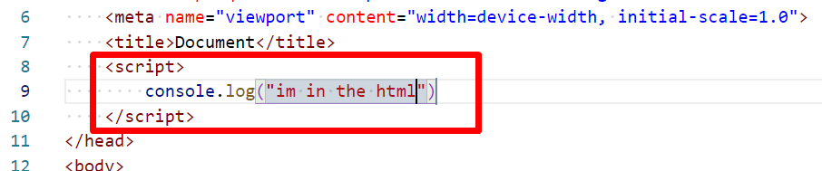
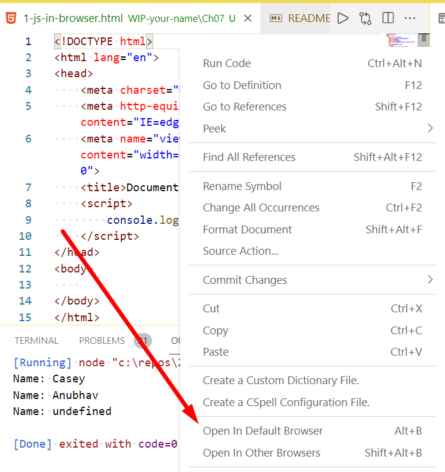
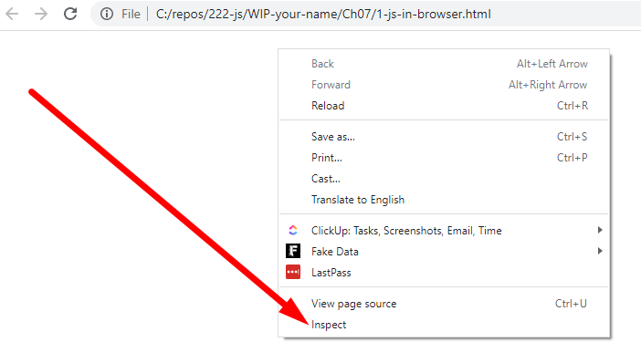
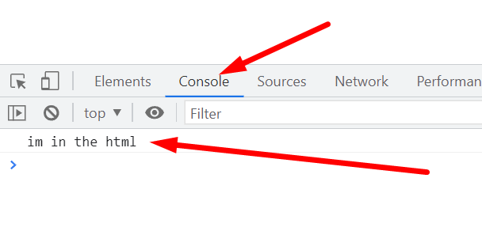
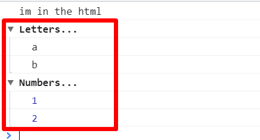

# Chapter 7: Lab 1 JS in browser

## Objectives

* Practice with syntax
* Create and run new HTML file
* Add Javascript to file

1. In your WIP folder create a folder called `Ch07`.

1. To this new folder, add an HTML file called `1-js-in-browser.html` by right-clicking the html folder and choosing `new file`.

1. In this new blank file start typing `html` - and choose the template with html:5 
    
   

1. Add in a script element in the head with a console.log. 
   

1. Because the Open In Browser extension is installed you can right click to open the HTML in the browser. Scroll to the bottom to click Open in browser, or use the keyboard shortcut.

   

1. Open the Dev Tools in the browser by right clicking in the browser window and choosing inspect.

   

1. Click on the console and check if your content is being displayed.

   

1. Mark your work as complete (online spreadsheet or in-class name tent card) then work on bonuses.

## Bonus

1. Use console.group() and console.groupEnd() to create this type of output.
 

