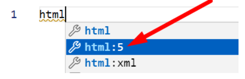

# Chapter 7: Lab 2 Window object

## Objectives

* Practice with syntax
* Create and run new Javascript file

1. In your WIP/Ch07 folder, create a new file called 2-window-obj.html

1. Use the shortcut as before to create the HTML file structure.

   

1. Add a scipt element and code to ask user for name, then print it to the console.

   

1. Open in browser (right click or keyboard shortcut) and see if your prompt works and the content is added to the console.

1. Mark your work as complete (online spreadsheet or in-class name tent card) then work on bonus.

## Bonus

1. Open the devtools and console tab.
1. Type window and hit enter.
1. Notice you can expand the global window object and view properties.
1. Modify the file you just worked on to practice with the various properties discussed on slides and ones you explore on MDN.

