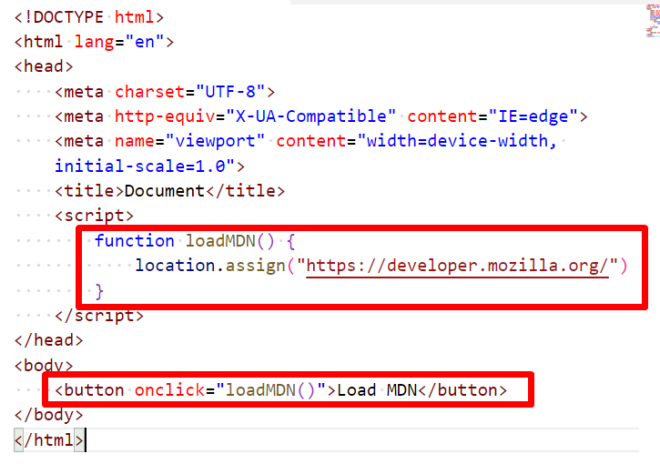

# Chapter 7: Lab 3 location object

## Objectives

* Use location to load a diffrent webpage

1. In your WIP/Ch07 folder, create a new file called 3-location.html using the html:5 template as before.

1. Add a function called loadMDN and a button that calls this function.

    

1. Open this in the browser

1. Click the button and see that you are directed to the MDN website.

1. Mark your work as complete (online spreadsheet or in-class name tent card) then work on bonus.

## Bonus

1. Use a prompt to ask the user to enter a URL, then use this to go to the website.

