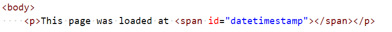
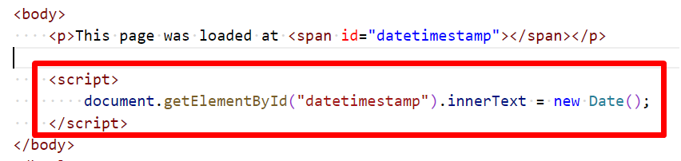

# Chapter 8: Lab 1 Document object
## Objectives

* Update DOM using document object

1. Create a new folder in your WIP folder called Ch08. 

1. Create a new file in this folder called 1-doc-obj.html - use the html:5 template to create the basic structure.

1. Add a paragraph to the body with an empty span that has an id value of datetimestamp.

    

1. Open the HTML page in the browser using Open in Browser from context menu or keyboard shortcut.

1. Confirm the page only says "This page was loaded at "

1. Add a script element before the closing body tag that targets the span element using its id value with the date for today.

    

1. Reload the page and confirm the update worked and you can see the dat timestamp.

1. Mark your work as complete (online spreadsheet or in-class name tent card) then work on bonuses for this chapter.

