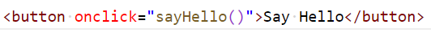
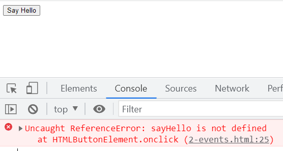
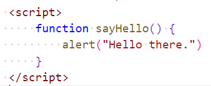
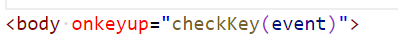
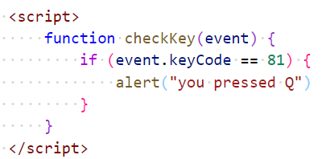

# Chapter 8: Lab 2 Events

## Objectives

* Practice with syntax
* Create and run new Javascript file

1. In your WIP/Ch08 folder, create a new file called 2-events.html with the template html:5 used.

1. In body - add a button that when clicked calls a function called sayHello. Be sure of your syntax, parenthesis are needed since you will be invoking the function with the button click.

    

1. Open your code in the browser. Open the Devtools to the console. Notice it is empty.

1. Try clicking the button and notice the message in the console. Do not close the browser, return to the VS Code editor.

    

1. Write the sayHello function to raise an alert.

    

1. Return to the browser and hit the reload button. Now click the button. You should see the alert and no error in the console.

1. Modify the body element to respond to a keyup event by calling a new function you will write  called checkKey. Be sure to pass the event object - it will contain info on which key was pressed.

    

1. Visit <https://keycode.info/> and test which key number represents the letter Q.

1. Use this value in a function that you write that raises an alert if you press the letter Q.

1. Add the checkKey function and check for Q being pressed, if it is raise an alert. 

    

1. Reload browser and test that hitting Q causes the alert.

1. Mark your work as complete (online spreadsheet or in-class name tent card) then work on bonuses.
