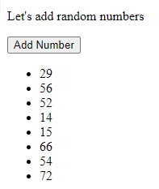

# Chapter 8: Lab 3 Nodes

## Objectives

* Add elements to the DOM

1. In your WIP/Ch08 folder, create a new file called 3-nodes.html using the html:5 template.

1. To body, add a p, a button with event handler, and ul element with an id value of numbers.
 

    

1. Open your code in the browser to be sure it looks correct.

    

1. In head create the start of a script element. 

    

1. Search the VS Code project for the function in demos named getRandomInteger. Click the result to get to the function. Copy this function into your script element.

    

    

1. Write the function addNumber to update the ul with a new li for a new random number.

    

1. Open your code in the browser, and click the button - you should see new numbers being added. 

    

1. Mark your work as complete (online spreadsheet or in-class name tent card) then work on bonuses.
