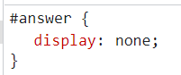

# Chapter 8: Lab 4 Manipulate CSS

## Objectives

* Change CSS using JS

1. In your WIP/Ch08 folder, create a new file called 4-css.html using the html:5 template.

1. Add the following content. If you have read Hitchiker's Guide to the Galaxy - you will get the reference. If not, check it out. Side note, 42 is the Ascii keycode for * (wildcard character).
    

1. Open in browser and confirm the display is as expected. 

    

1. Hide the answer by adding this CSS in the head element.

    

1. Reload the browser. Confirm the answer is now hidden.

    

1. Add the showAnswer function to target the element and change its CSS property to not longer have display hidden but block.

    

1. Return to the browser - but do not click the button yet. Make sure you have the devtools open to the elements. Notice you can see the p#answer element in the DOM. Click on this if it is not already selected.

    

1. When the element is selected in the devtools Elements/DOM - you will see the CSS being applied for the element. 

    

1. Click the button and watch for the change in the devtools. The purple flash lets you know there is a change occuring.

    

1. Notice the CSS shows the change as well.

    

1. Mark your work as complete (online spreadsheet or in-class name tent card) then work on bonuses.
