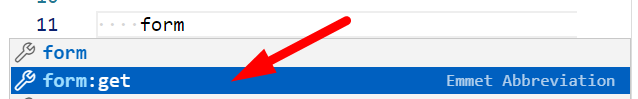
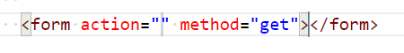
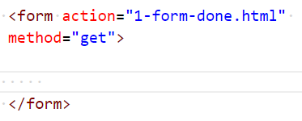
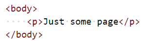
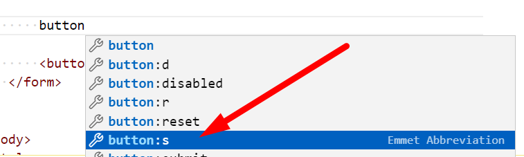
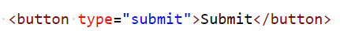
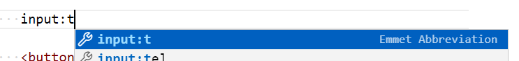
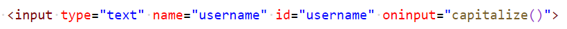
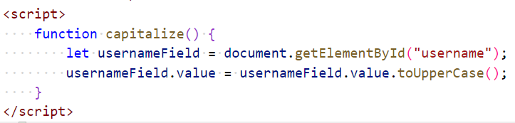

# Chapter 9: Lab 1 Form input
## Objectives

* Create and interact with form elements
## Steps

1. Create a new folder in your WIP folder called Ch09.  

2. Create a new file in this folder called 1-form-input-data.html

1. Create form to make a get request. Start typing form in the body - with no angle brackets - and choose the emmet abbreviation

    

1. Notice the output of the abbreviation. Your cursor will be in the action and you can type this then hit tab to get to the inner content of the form element.

    

1. For action, type 1-form-done.html for now. Later we will discuss submitting to a server.

    

1. In the same directory, create another html page called 1-form-done.html, use the html:5 template, and have only this minimal content in body.

    

1. Return to 1-form-input.html. In form element start typing the word button (WITHOUT the < symbol / angle bracket) and choose the emmet abbreviation for submit type.

    

1. Update the text to read Submit

    

1. Open this in your in browser and test that clicking the button goes to the done page.

1. Continuing in 1-form-data.html - above the submit button start typing in plain text - input:t then choose the emmet abbreviation for this input type = text.

    

1. Complete the attributes as shown adding a handler for oninput.

    

1. Create a script and define a capitalize function to take value of the input and convert to uppercase, storing it back into the element value.

    

1. Open in the browser and test that this works as expected.

1. Mark your work as complete (online spreadsheet or in-class name tent card) then go on to the bonus for this chapter.