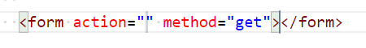

# Chapter 9: Lab 2 Stop submit

## Objectives

* Practice with syntax
* Create logic to stop a form submit

1. Continue work in your WIP folder called Ch09.  

2. Create a new file in this folder called 2-stop-submit.html

1. Create a form with emmett abbreviation, using form in plain text.

    

    

1. Start to type the action to be 1-form-done.html. As you type you may notice a pop-up with suggestion. If not you may be able to trigger this with control + space. 

    

1. Add the a submit button using the emmet abbreviation.

    

1. Open in browser, click the button and show this form also goes to the done page.

1. Return to your 2-stop-submit.html file and modify the form element to have an onsubmit handler to anew function you will write.

    

1. In the head element start typing script and use the emmet abbreviation to get the start tag, end tag and have cursor in the middle.

    
 

1. Add the function called stopSubmit

    

1. Return to the browser and test that instead of submitting the form, only a message appears in the devtool console.

    

1. Mark your work as complete (online spreadsheet or in-class name tent card) then go on to the bonus for Chapter 3.