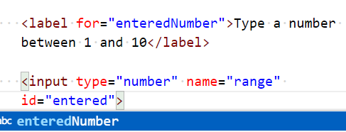

# Chapter 9: Lab 3 Validation

## Objectives

* Use JS for validation

## Steps

1. Continue work in your WIP folder called Ch09.  

2. Create a new file in this folder called 3-validation.html 

1. In this file, create a form with emmet abbreviation.

1. In form start typing label and use emmett abbreviation.

    

1. For the for value put enteredNum and add the label text.

    

1. Use the emmet abbreviation for input:n

    

1. Use same value as label for the input id - enteredNumber. As you are typing you may get an autocomplete helper.

    

1. Make sure it looks correct.

    

1. Update the form to have an onsubmit handler calling a checkNumber function.

    

1. Write the script to validate the number and return false if it fails validation.

    

1. Mark your work as complete (online spreadsheet or in-class name tent card) then practice adding more validation to your bonus.