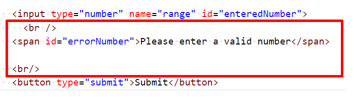
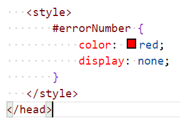
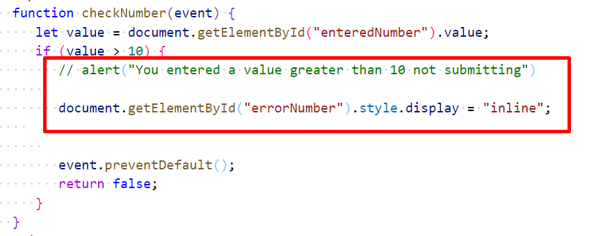

# Chapter 9: Lab 4 Feedback

## Objectives

* Display error message

## Part 2 Create and run files

1. Continue work in your WIP folder called Ch09.  

1. Create a new file in this folder called 4-feedback.html

1. Copy the contents of the last file you worked on 3-validation.html

1. Modify the form to have a span after the input field. Ad line breaks - br - to make things on difference lines.

   

1. Load in your browser.

1. Add CSS to make the error message in red and to hide the message so it only appears when there is an error.

   

1. Update the validation logic to change the CSS when there is an error.

    
 

1. Reload in the browser and test that if an invalid number is entered the error is displayed. 

1. Mark your work as complete (online spreadsheet or in-class name tent card) then go on to the bonus.

## Bonus 

1. Update the input that when the user changes the form data (keyup event) the validation runs, and removes the error message if it is valid. 

