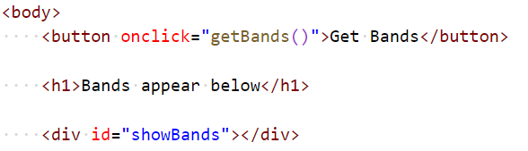
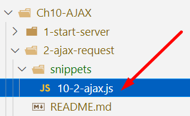
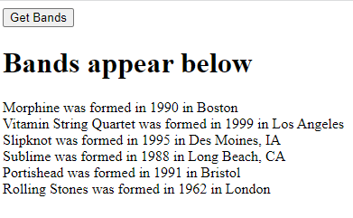

# Chapter 10: Lab 2 AJAX request

## Objectives

* Send a request to the server running on localhost

1. In your Ch10 folder, create a new file in this folder called 2-ajax-request.html

1. Create the HTML so that a button can be click to initiate a request to update a div on a page with results. 

    

1. Before the closing body tag, add a script tag. Copy the contents from this directories snippets into your code. Review this code that makes the AJAX request.

    

1. The HTML script element should now have the two functions getBands() and populateBandsDiv()

1. Make sure the server from Ch10-AJAX/1-start-server is still running.

1. Open your code in the browser. Does it work?

    

1. Mark your work as complete (online spreadsheet or in-class name tent card).

## Bonus

1. Format the output of bands into a table.

1. Create a form that takes in a band id, use it to create the URL in the format of /bands/id and display the results of the GET request.

1. Create a form that allows a new band to be created. Call send() passing a JSON bject with the band properties. The id will be created for you.