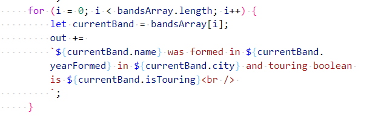
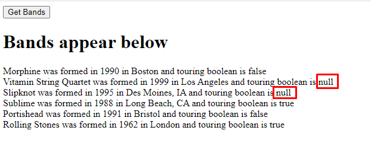
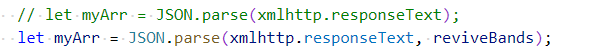
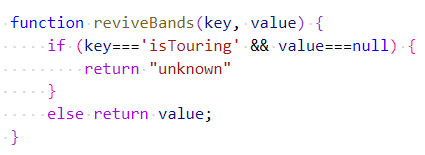

# Chapter 10: Lab 3 JSON data

## Objectives

* Use JSON reviver function

1. In your Ch10 folder, create a copy of your file 2-ajax-request.html and call it 3-json.html. You can do this by right-clicking and choosing copy - and then choosing paste.

1. Update the display function to use the isTouring value as shown.

    

1. Run the code and note the output. It contains null due to the data in db.json. This can be improved.

    

1. Update the getBands to use a reviver function.

    

1. Create the reviver function - this looks for thos enull values and replaces them with the word unknown.

    

1. Refresh your browser and hit the button again. Note the improved output.

    

1. Mark your work as complete (online spreadsheet or in-class name tent card).
