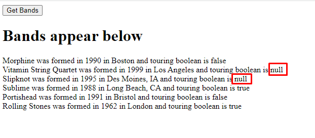
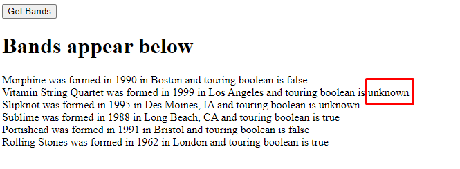

# Chapter 10: Lab 4 Use of Promise data

## Objectives

* Use Promise notation

1. In your Ch10 folder, create a copy of your file 3-json.html and call it 4-promise.html. You can do this by right-clicking and choosing copy - and then choosing paste and right-clicking to rename this copy file to 4-promise.html

1. Update the getBands function to use the Fetch API instead of the XMLHttpRequest. The FetchAPI is much simpler and uses promises. Frist to get the response, then convert from JSON, then passing off to populateBandsDiv.

    

1. Open the code in the browser. Click the button and you should see the results - though having the unknowns.

    

1. You can update the call to Fetch to first get the response as plain text - then using JSON.parse with reviver, as shown:

    

1. Refresh your browser and hit the button again. Note the improved output.

    

1. Mark your work as complete (online spreadsheet or in-class name tent card).
