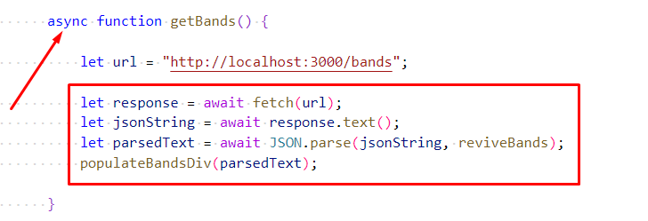
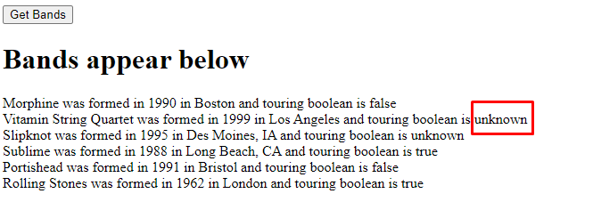

# Chapter 10: Lab 5 Use of async / await

## Objectives

* Use Promise notation

1. In your Ch10 folder, create a copy of your file 4-promise.html and call it 5-async.html. You can do this by right-clicking and choosing copy - and then choosing paste and right-clicking to rename this copy file to 5-async.html

1. Update the getBands function to use async/await. Here is the code to do this. Note the use of async in front of the function name, and the use of await instead of the promise syntax. 

    

1. Open your browser and click the button the output should 

    

1. Mark your work as complete (online spreadsheet or in-class name tent card).
